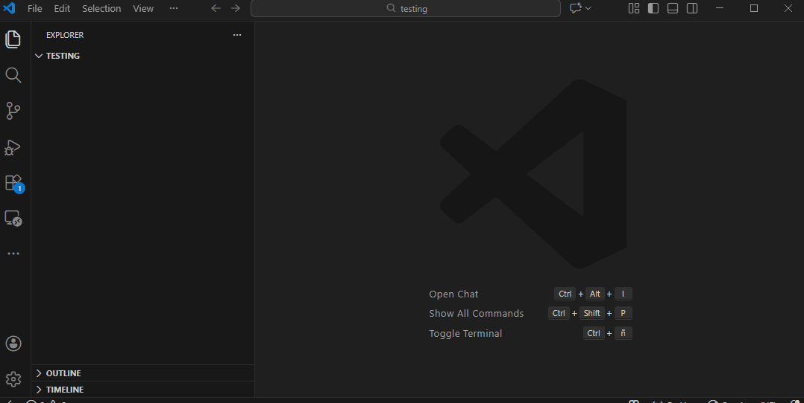

Hello, boss! This is:

## Tree-to-Folder Generator

  This VS Code extension transforms plain text directory schemas into real project structures with a single click.

How to use: Right-click any folder or empty space in the Explorer and select "Generate from Tree".

    Two Ways to Input:

    Editor Mode: Opens a temporary scratchpad—ideal for pasting large, complex trees from a README or AI chat.

    Quick Input: A simple pop-up box for fast, single-line or small structures.

#### Smart Parsing: 

- The extension automatically strips away emojis (📦, 📂), box-drawing characters (┣, ┗, ┃), and guide lines. It focuses purely on indentation and names to build your project.

#### Intelligent Hierarchy: 

- It detects folders vs. files based on nesting and extensions. If an item has "children" indented underneath it, the extension knows it's a folder, even if it has a file-like name.

#### Safe Preview: 

- Before any files are created on your disk, the extension shows a preview list of the final paths. You can verify the structure and click "Create" to confirm or "Cancel" to tweak your text.

#### Pro-Tip:

To handle highly complex or "messy" trees with broken guide lines, we recommend using the Editor Mode. Just paste your text, hit the Generate button in the notification, and let the extension do the heavy lifting.

### Actual fact:
If you think, “Yes, if I put three completely different trees with different characters, it won't work properly,” yes, that's what will happen. It won't work with 100% accuracy. 

You don't have to think too much about it. Just copy paste the tree and generate.

Not perfect but enough.