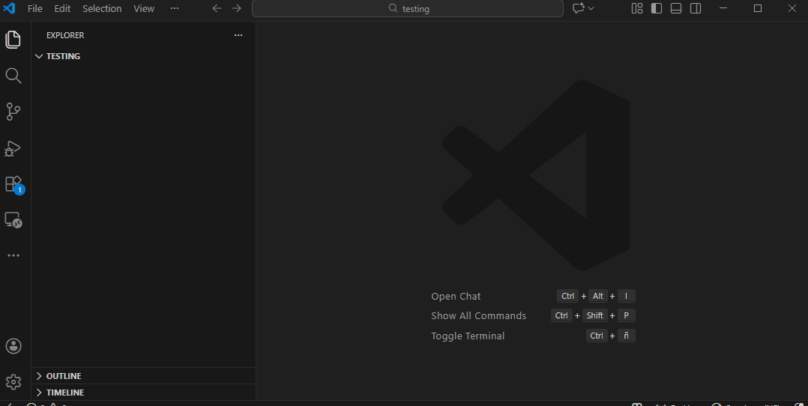

#### Bienvenido

¡Hola, jefe! Esto es:



## Generador de Árbol a Carpeta


  Esta extensión de VS Code transforma esquemas de directorios en texto plano en estructuras de proyecto reales con un solo clic.

Cómo usarlo: Haz clic derecho en cualquier carpeta o espacio vacío en el Explorador y selecciona "Generate from Tree".

    Dos formas de ingresar datos:

    Modo Editor: Abre un bloc de notas temporal, ideal para pegar árboles grandes y complejos desde un README o un chat de IA.

    Entrada Rápida: Un simple cuadro emergente para estructuras rápidas de una línea o pequeñas.

#### Análisis Inteligente:

- La extensión elimina automáticamente emojis (📦, 📂), caracteres de dibujo de cajas (┣, ┗, ┃) y líneas guía. Se centra únicamente en la sangría y los nombres para construir tu proyecto.

#### Jerarquía Inteligente:

- Detecta carpetas frente a archivos según el anidamiento y las extensiones. Si un elemento tiene "hijos" sangrados debajo de él, la extensión sabe que es una carpeta, aunque tenga un nombre similar al de un archivo.

#### Vista Previa Segura:

- Antes de crear ningún archivo en tu disco, la extensión muestra una lista de vista previa con las rutas finales. Puedes verificar la estructura y hacer clic en "Create" para confirmar o en "Cancel" para ajustar tu texto.

#### Consejo Pro:

Para manejar árboles altamente complejos o "desordenados" con líneas guía rotas, recomendamos usar el Modo Editor. Simplemente pega tu texto, presiona el botón Generate en la notificación, y deja que la extensión haga el trabajo pesado.

### Dato real:
Si estás pensando: "Sí, si pongo tres árboles completamente diferentes con caracteres distintos, no va a funcionar bien", sí, eso es exactamente lo que pasará. No funcionará con una precisión del 100%.

No tienes que pensarlo demasiado. Simplemente copia y pega el árbol, y genera.

No es perfecto, pero es suficiente.

## Instalación Manual
Simplemente sigue este sencillo tutorial si no encontraste este plugin en el Extensions Marketplace (esto asume que realmente estás dentro de una carpeta mientras usas VS Code);

#### 1. Requisitos previos
Asegúrate de tener Node.js instalado, luego instala el Administrador de Extensiones de VS Code de forma global:


```bash
npm install -g @vscode/vsce
```

#### 2. Compilar la Extensión
Clona el repositorio y genera el paquete de instalación:

```bash
git clone https://github.com/gattocci/tree-to-folder.git
cd tree-to-folder
npm install
npm run compile
vsce package
```
#### 3. Instalar en VS Code
Después de ejecutar los comandos anteriores, se creará un archivo llamado tree-to-folder-1.0.0.vsix en tu carpeta. Para instalarlo:

Vía interfaz gráfica: Abre VS Code, ve a la vista de Extensiones (Ctrl+Shift+X), haz clic en "..." (Ver y más acciones) en la esquina superior derecha, selecciona Install from VSIX..., y elige el archivo generado.

Vía terminal: Ejecuta el siguiente comando:

```bash
code --install-extension tree-to-folder-1.0.0.vsix
```

¡O descarga la extensión directamente desde dentro de VS Code!
--aún no--
---

#### English

Hello, boss! This is:


## Tree-to-Folder Generator


  This VS Code extension transforms plain text directory schemas into real project structures with a single click.

How to use: Right-click any folder or empty space in the Explorer and select "Generate from Tree".

    Two Ways to Input:

    Editor Mode: Opens a temporary scratchpad—ideal for pasting large, complex trees from a README or AI chat.

    Quick Input: A simple pop-up box for fast, single-line or small structures.

#### Smart Parsing: 

- The extension automatically strips away emojis (📦, 📂), box-drawing characters (┣, ┗, ┃), and guide lines. It focuses purely on indentation and names to build your project.

#### Intelligent Hierarchy: 

- It detects folders vs. files based on nesting and extensions. If an item has "children" indented underneath it, the extension knows it's a folder, even if it has a file-like name.

#### Safe Preview: 

- Before any files are created on your disk, the extension shows a preview list of the final paths. You can verify the structure and click "Create" to confirm or "Cancel" to tweak your text.

#### Pro-Tip:

To handle highly complex or "messy" trees with broken guide lines, we recommend using the Editor Mode. Just paste your text, hit the Generate button in the notification, and let the extension do the heavy lifting.

### Actual fact:
If you think, “Yes, if I put three completely different trees with different characters, it won't work properly,” yes, that's what will happen. It won't work with 100% accuracy. 

You don't have to think too much about it. Just copy paste the tree and generate.

Not perfect but enough.

## Manual Installation
Just follow this simple tutorial if you not found this plugin in the Extensions Marketplace (This assume that you actually are inside a folder while using VS Code);

#### 1. Prerequisites
Ensure you have Node.js installed, then install the VS Code Extension Manager globally:


```bash
npm install -g @vscode/vsce
```

#### 2. Build the Extension
Clone the repository and generate the installation package:

```bash
git clone https://github.com/gattocci/tree-to-folder.git
cd tree-to-folder
npm install
npm run compile
vsce package
```
#### 3. Install to VS Code
After running the commands above, a file named tree-to-folder-1.0.0.vsix will be created in your folder. To install it:

Via UI: Open VS Code, go to the Extensions view (Ctrl+Shift+X), click the "..." (Views and More Actions) at the top right, select Install from VSIX..., and choose the generated file.

Via Terminal: Run the following command:

```bash
code --install-extension tree-to-folder-1.0.0.vsix
```

Or directly download the extension inside VS code!
--not yet--